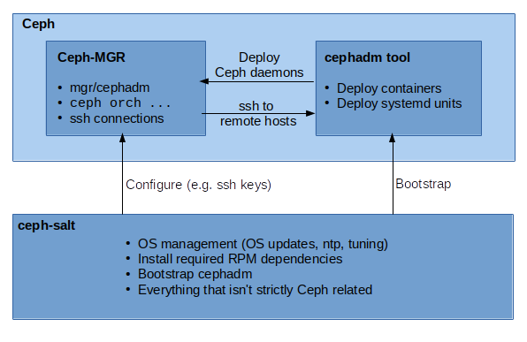

# ceph-bootstrap - Deploy Ceph clusters using cephadm<br/> [](https://travis-ci.com/SUSE/ceph-bootstrap) [](https://codecov.io/gh/SUSE/ceph-bootstrap)

This project provides tools for deploying [Ceph][ceph] clusters managed by
[cephadm][cephadm] using [Salt][salt]. It delivers missing pieces to fully
manage a Ceph cluster with cephadm:

- OS management (performing OS updates, ntp, tuning)
- Install required RPM dependencies
- Bootstrap cephadm
- Enhanced bootstrapping by defining roles for Salt minions
- Work in progress: Migration from [DeepSea][deepsea] to cephadm

# Components

This repository contains two components:

1. `ceph-salt-formula` is a Salt Formula using Salt Highstates to manage Ceph
   minions.
2. `ceph-bootstrap` is a CLI tool to manage the Salt Formula.

# Architecture



# Setup

In order to use `ceph-bootstrap`, you need a working Salt cluster.

Now, install `ceph-bootstrap` on your Salt Master from the openSUSE
repositories:

```
zypper in ceph-bootstrap
```

Afterwards, reload the salt-master daemon

```
systemctl restart salt-master
salt \* saltutil.sync_all
```

# Usage

To deploy a Ceph cluster, first run `config` to start the configuration shell to
set the initial deployment of your cluster:

```
ceph-bootstrap config
```

First step of configuration is to add the salt-minions that should be used for
deploying Ceph the command `add` under `/Cluster/Minions` option supports
autocomplete and glob expressions

```
/Cluster/Minions add *
```

Next step is to specify which minions should be used to store the ceph-mons and
mgrs. ceph-bootstrap will choose one of these minions to run
`cephadm bootstrap`. These minions will also be the entry points for the
administrator to run ceph orchestrator commands, as we will install and
configure the ceph client tool on these nodes

```
/Cluster/Roles/Mon add node1*
/Cluster/Roles/Mgr add node1*
```

Now we need to set the SSH key pair to be used by the ssh orchestrator the SSH
key can be generated by ceph-bootstrap with the following command

```
/SSH generate
```

Finally we need to set which minion to use as the time server and add an
external NTP server hostname to sync the time

```
/Time_Server/Server_Hostname set <fwdn of the admin node>
/Time_Server/External_Servers add 0.pt.pool.ntp.org
```

Afterwards, run `deploy` to start the `ceph-salt-formula` and execute the
deployment.

```
ceph-bootstrap deploy
```

[ceph]: https://ceph.io/
[salt]: https://www.saltstack.com/
[cephadm]: https://docs.ceph.com/docs/master/mgr/cephadm/
[deepsea]: https://github.com/SUSE/DeepSea
